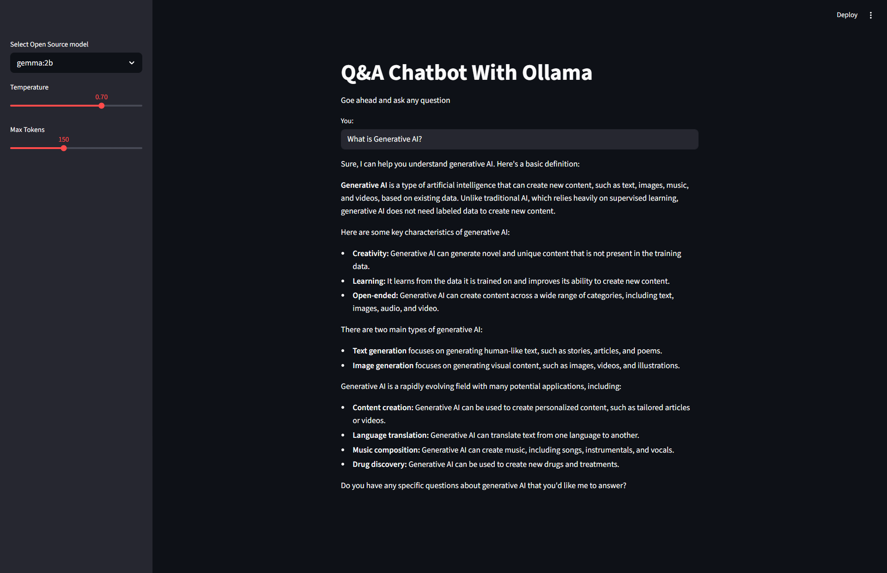

# Q&A Chatbot With Ollama

A lightweight Q&A chatbot that runs open-source language models locally using [Ollama](https://ollama.com/), with an interactive web interface built on [Streamlit](https://streamlit.io/).



## Features

- **Local LLM inference** — runs models on your machine via Ollama, no cloud API calls required
- **Interactive web UI** — Streamlit-based interface with sidebar controls for model selection, temperature, and max tokens
- **LangChain integration** — uses prompt templates and output parsing from the LangChain framework
- **LangSmith tracing** — optional observability and monitoring of LLM interactions

## Prerequisites

- [Python 3.12+](https://www.python.org/downloads/)
- [Ollama](https://ollama.com/) installed and running
- A model pulled in Ollama (default: `gemma:2b`)

## Setup

1. **Clone the repository**

   ```bash
   git clone <repository-url>
   cd Q&A-Chatbot-with-Ollama
   ```

2. **Create and activate a virtual environment**

   ```bash
   python -m venv .venv

   # Windows
   .venv\Scripts\activate

   # macOS / Linux
   source .venv/bin/activate
   ```

3. **Install dependencies**

   ```bash
   pip install -r requirements.txt
   ```

4. **Pull the Ollama model**

   ```bash
   ollama pull gemma:2b
   ```

5. **Configure environment variables**

   Create a `.env` file in the project root:

   ```
   LANGCHAIN_API_KEY=your_langsmith_api_key_here
   ```

   > Get a free API key at [smith.langchain.com](https://smith.langchain.com/) if you want LangSmith tracing enabled.

## Usage

Start the application:

```bash
streamlit run app.py
```

This opens the chatbot in your browser. Use the sidebar to:

| Control     | Description                                               | Range      | Default    |
| ----------- | --------------------------------------------------------- | ---------- | ---------- |
| Model       | Select the Ollama model to use                            | `gemma:2b` | `gemma:2b` |
| Temperature | Controls response randomness (lower = more deterministic) | 0.0 - 1.0  | 0.7        |
| Max Tokens  | Limits the response length                                | 50 - 300   | 150        |

Type your question in the text input and the chatbot will respond using the selected model.

## Project Structure

```
Q&A-Chatbot-with-Ollama/
├── app.py               # Main application — UI, prompt template, LLM chain
├── requirements.txt     # Python dependencies
├── .env                 # Environment variables (not tracked in git)
├── .gitignore           # Git ignore rules
└── app-screenshot.png   # UI screenshot
```

## Tech Stack

| Technology    | Purpose                         |
| ------------- | ------------------------------- |
| Streamlit     | Web UI framework                |
| LangChain     | LLM orchestration and prompting |
| Ollama        | Local open-source model runtime |
| LangSmith     | LLM tracing and observability   |
| python-dotenv | Environment variable management |

## Adding More Models

To use a different model, pull it with Ollama and add it to the selectbox in `app.py`:

```bash
ollama pull llama3
ollama pull mistral
```

Then update line 35 in `app.py`:

```python
llm = st.sidebar.selectbox("Select Open Source model", ["gemma:2b", "llama3", "mistral"])
```
